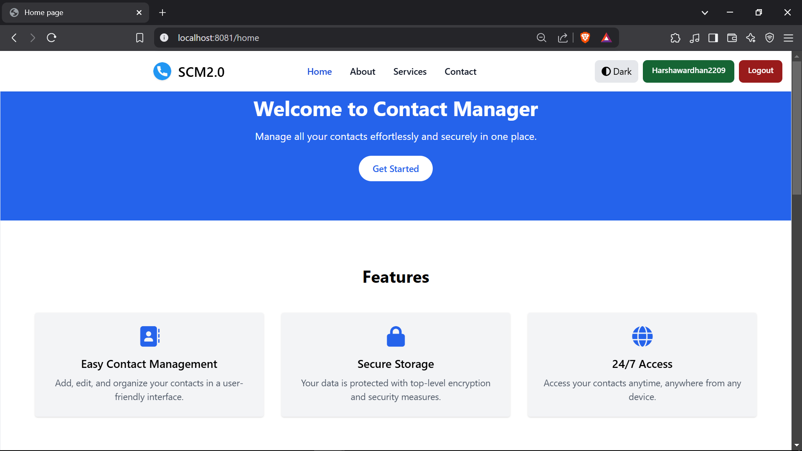
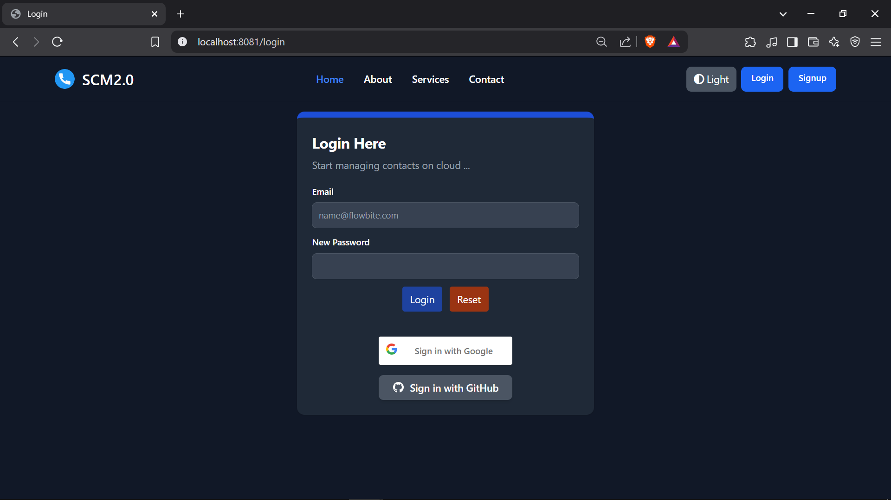
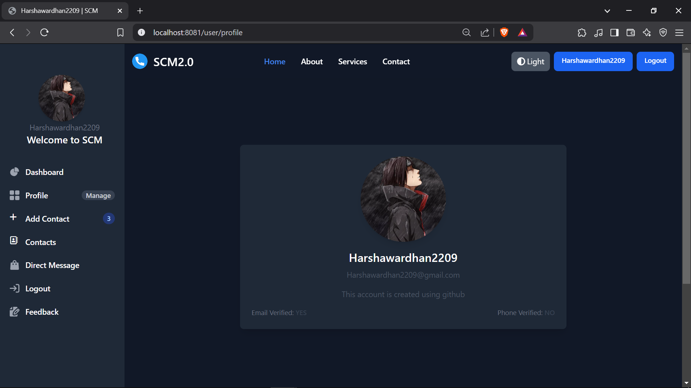
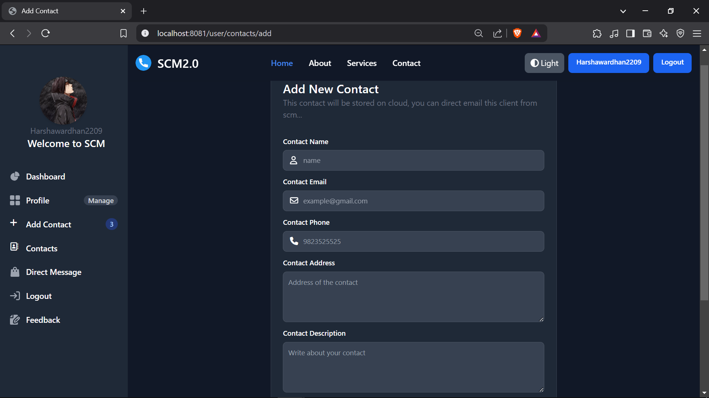
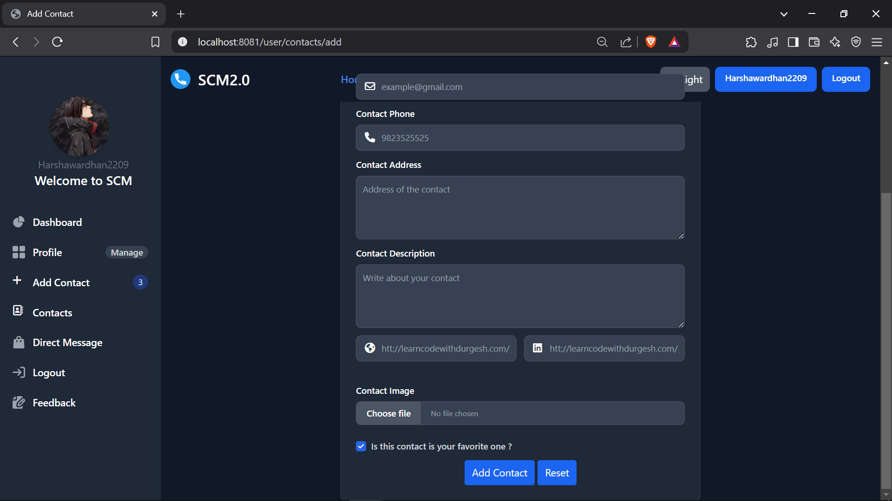
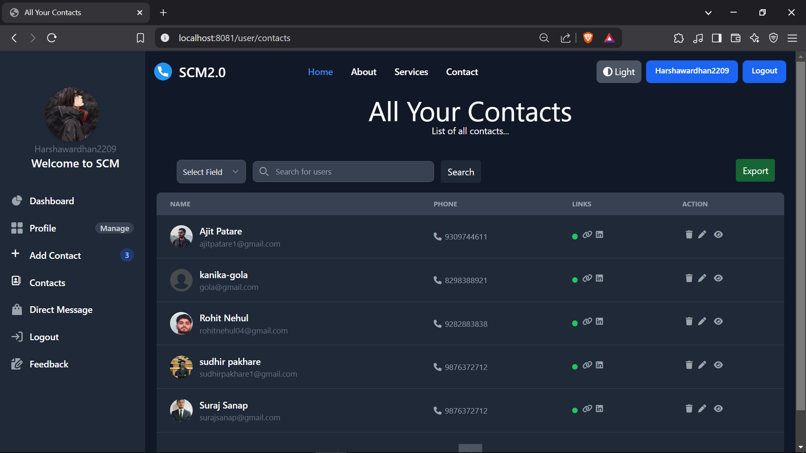
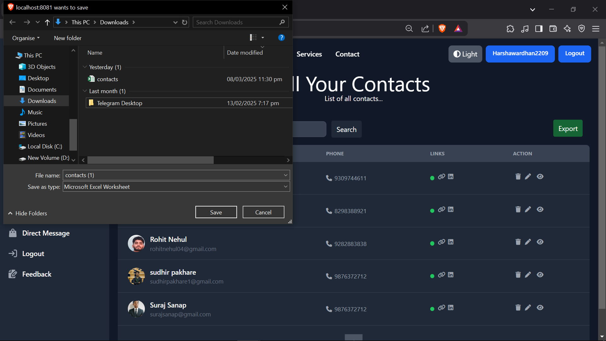

# Connectify - AI-Powered Sales Automation Tool

Connectify is an **AI-powered sales automation tool** built with **Spring Boot** to reduce manual workload and accelerate product shipments. It integrates AI-driven predictive analytics to optimize workflow efficiency and operational speed.

## Features & Pages

- **Home Page**: Overview of the application.
- **User Dashboard**: Manage contacts securely.
- **Admin Panel**: User and data management.
- **Add Contact**: Save new contacts with details.
- **Edit Contact**: Modify existing contacts.
- **Delete Contact**: Remove contacts safely.
- **User Authentication**: Secure login and signup.

## Tech Stack

**Java**  
**Spring Boot**  
**PostgreSQL**  
**Thymeleaf**  
**HTML**  
**CSS**  
**JavaScript**  
**JWT**  
**AI Automation**

## Dependencies

- **Spring Security** (Authentication & Authorization)
- **Hibernate & JPA** (ORM & Database Handling)
- **Tailwind CSS** (UI Styling)

## Project Structure

```
Connectify/
├── src/main/java/com/connectify
│   ├── controllers/    # Controllers for handling requests
│   ├── models/         # Entity classes
│   ├── repository/     # JPA repositories
│   ├── services/       # Business logic
│   └── Application.java # Main entry point
├── src/main/resources/
│   ├── static/         # CSS, JS, Images
│   ├── templates/      # Thymeleaf templates
│   ├── application.properties # Configuration
└── pom.xml             # Dependencies (Maven)
```

## Setup Instructions

1. **Clone the Repository**

   ```sh
   git clone https://github.com/your-repo/connectify.git
   cd connectify
   ```

2. **Configure the Application Properties** (Update `application.properties`)

   ```properties
   # Database Configuration
   spring.datasource.url=jdbc:postgresql://localhost:5432/connectify_db
   spring.datasource.username=root
   spring.datasource.password=yourpassword
   spring.jpa.hibernate.ddl-auto=update

   # Google OAuth 2.0
   spring.security.oauth2.client.registration.google.client-id=${GOOGLE_CLIENT_ID}
   spring.security.oauth2.client.registration.google.client-secret=${GOOGLE_CLIENT_SECRET}
   spring.security.oauth2.client.registration.google.scope=email,profile

   # Github OAuth 2.0
   spring.security.oauth2.client.registration.github.client-id=${GITHUB_CLIENT_ID}
   spring.security.oauth2.client.registration.github.client-secret=${GITHUB_CLIENT_SECRET}
   spring.security.oauth2.client.registration.github.scope=email,profile

   # Cloudinary Configurations
   cloudinary.api.key=${CLOUDINARY_API_KEY}
   cloudinary.api.secret=${CLOUDINARY_API_SECRET}
   cloudinary.cloud.name=${CLOUDINARY_NAME}

   # Email Configurations
   spring.mail.host=smtp.gmail.com
   spring.mail.port=${EMAIL_PORT}
   spring.mail.username=${EMAIL_USERNAME}
   spring.mail.password=${EMAIL_PASSWORD}
   spring.mail.properties.mail.smtp.auth=true
   spring.mail.properties.mail.smtp.starttls.enable=true
   spring.mail.properties.domain_name=${EMAIL_DOMAIN}
   ```

3. **Run the Application**

   ```sh
   mvn spring-boot:run
   ```

4. **Access the Application**

    - Open `http://localhost:8080` in your browser.

## Screenshots

### Login Page


### User Dashboard


### Profile


### Add Contact Page


### Edit Contact Page


### Admin Panel


### Export to Excel


## License

This project is licensed under the MIT License.
=======
>>>>>>> 7a6e21108ddce93c47442ee7e43302bd4a4f3c1d

